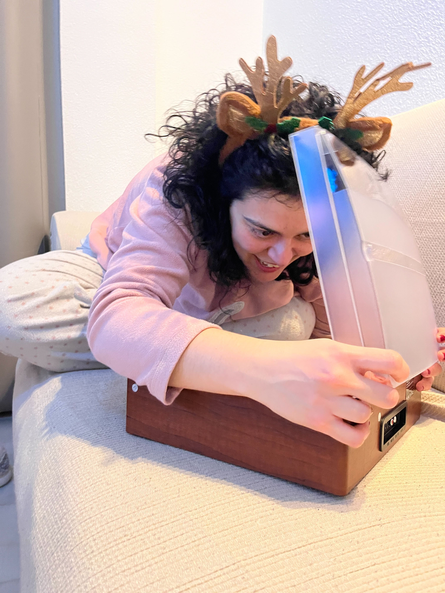

% Azul Tanzanita
% [Erik Bermejo](https://github.com/MariposaGentil)
% 2025-01-02



It’s been a while since I last wrote in this journal, and I’m reminded of the pending UI improvements on this site. But let’s stick to the topic.

Today is January 2nd, 2025, and this Christmas season has been both confusing and transformative. On December 8th, I asked the girl I like to go out. After an incredible week together, it felt like a definite “Yes,” but then she admitted she was scared about the future. The following week turned out to be one of the toughest of the year. However, we reconnected after that.

On Christmas Eve, December 24th, we were texting on WhatsApp. When she asked how I was, I candidly admitted that I wasn’t doing great. We decided to meet and talk about my feelings. At her house, I opened up about how much I wanted to be with her every single day. To my surprise and relief, she said she felt the same and wanted to be together. From that moment, everything shifted. We’ve been spending as much time together as we’ve wanted, and it’s been amazing.

These past days have been a whirlwind. I’ve been part of her chosen family, and we’ve been practically living together. She’s fallen deeply in love with me, and her feelings are incredibly strong. On my part, I’ve realized that I truly love her. Still, I’m slightly worried about the possibility of her developing a sense of co-dependency. I genuinely want this relationship to work, and for that, I know we’ll both need time for ourselves occasionally.

For now, we’re living in the moment, enjoying each other’s company every chance we get. Yesterday, she asked me to read a beautiful poem, “La escala de Mohs” by Gata Cattana. She blushed as I read it aloud, though I didn’t fully grasp its meaning at first. Later, I reread it privately and understood its depth. The poem describes someone being “sold for a pair of blue eyes,” and I realized it was about me. The realization nearly brought me to tears. Expressing that level of emotion felt intimidating, so I held back, unsure why.

This holiday season has been unlike any other, filled with challenges, love, and growth. Here’s to seeing where this journey takes us.

==== The previous text has been polished by an AI. ===

I really want to be with her instead of working or exercising :/

```
Todo el mundo se vende.
Al final.. todo el mundo.

Yo me vendí por tres milímetros
de iris azul tanzanita
en cada ojo
lo que hacen un total de seis
por dos de ancho
milímetros de iris azul radiactivo,
azul heisenberg.

No se si al diablo o a quién…
porque en Cupidos no creo,
pero cambié mis veredas livianas
y el jardín de trofeos
y mis cuevas de ego sin fondo
sin tregua ni amparo
y esta mala fe de augura
y el mañana, y el ahora…
por seis por dos milímetros de iris
de topacio azul,
de dureza ocho
en la escala de Mohs.

Y cambié mis sonrisas infalibles
hábilmente conseguidas
y las ganas de los otros
y el discurso de Gomorra
y de Artemisas en Arcadias…

En resumidas cuentas,
la heroicidad de la independencia,
la certeza de no ir viendo fantasmas
como Bécquer,
y he aquí la paradoja:
por seis por dos de pupila azul turmalina,
con algo de cobalto y de polonio,
y lo de polonio no lo digo por el color.

Al final todo el mundo…
Todo el mundo tiene un precio.

Y quién me iba a decir a mí
que después de tanto principio,
tanta ley y tanto código, tanto juez
y tanta ética, tanto farol bien tirao…
que el mío iba a ser tan minúsculo.

Yo siempre lo supe.

Desde que a Aquiles le dieron
a elegir entre la gloria o la paz,
yo ya lo sabía,
hubiera elegido lo segundo.
No soy de cantares de gesta.

Y siempre releía la historia
advirtiéndole desde mis adentros
a ver si no cometía el mismo error.
Pero nada.
Y claro,
directa al talón.

Yo hubiera elegido lo otro,
siempre se lo dije.
Hubiera muerto a los setenta
en una islita griega mirando el mar.

Al fin y al cabo la gloria no es tanto…
La gloria debe ser morirse
en una islita griega mirando el mar.

Al fin y al cabo…
¿Quién se acuerda hoy de Aquiles?
Si no es esta loca rumiante mascullando
te lo dijes.
Para eso has quedado.
Para lo que quedó Troya.

Para que venga ahora esta loca
rumiante mascullando te lo dijes
a altas horas.

Otras noches te comprendo.
Y te compadezco.
Y nos compadezco.
En cierto modo algo de razón tenías,
todo el mundo tiene un precio.

Y quién me iba a decir a mí,
quién nos iba a decir,
que el mío fuera un total
de seis por dos milímetros cuadrados
de iris tapiz de hilo persa,
azul egipcio,
Bombay Sapphire,
de dureza ocho
en la escala de Mohs.

Yo hubiera elegido lo otro,
siempre te lo dije.
Aunque en cierto modo puede
que tuvieras razón.
Quién sabe si tenías razón.
```


=== Original Text ===
```
There has been a while since I last wrote in the journal... and there are several improvements to the UI of this site pending...Ok, I'm drifting away from the topic.

Its 2/01/2025... And this chirstmas has been really confusing... Dec 8th I asked the girl I like to go out, and after one great week together, making as it was a **Yes**, she told me that she was a bit afraid of the future. We spent one of the worst weeks of the year and after that, we met again. 

**December 24th**, Christmas eve, we were talking using whatsapp, she asked me how I was, and a little bit tired, I answered that I wasn't doing great. We agreed to meet a talk a bit about how I felt. In her house, after explaining how I wanted to be with her every hour of every day, she told me that she was feeling the same, she also told me that she wanted to be together. From that point on we have been together as much as we wanted.

Its been great, I've been part of her friend's family and we have been living together as much as we could. She has fell in love with me and has really strong feelings. Me, on my side, I really feel that I love her and doesn´t have any kind of idea of running away. Being honest, I'm a little afraid of she developing a bit of co-dependency with me, I really want this to work and for that We both will need a bit of time for ourselves. 

For now, We are doing what we want, spending every minute with each other. Yesterday, she made me read a cute poem: 'La escala de mohs' by Gata Cattana. She was really red while I was reading it, but I wasn't getting it. I was just announcing it but didn't undserstand it. After that, I read it for myself and tried to understand it. It talks about *someone being sold for couple of blue eyes*... I understood it was talking about me.... I almost cried, that would be really cool to do, but something told me to not let it flow.
```